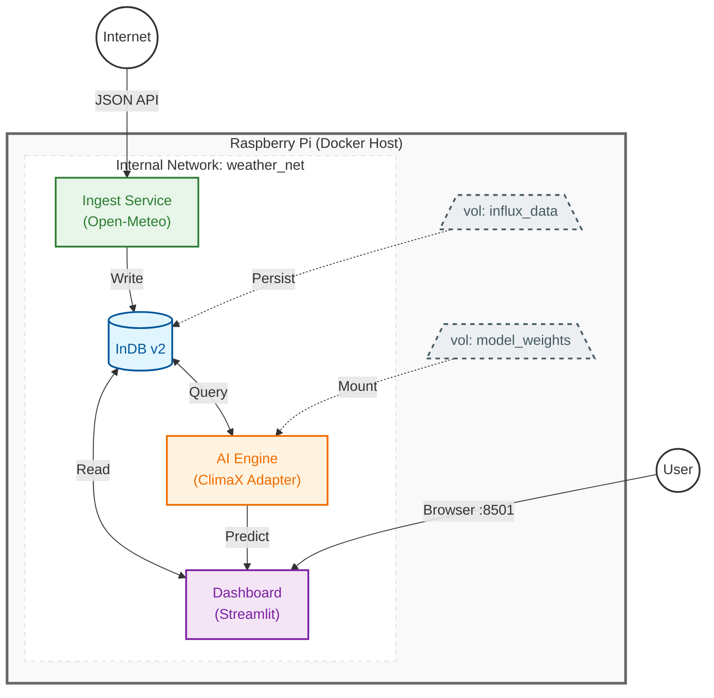

This project started as a way to combine my interest in meteorological data with edge computing. The goal was to build a system that doesn't just display weather data, but actually "understands" the microclimate of the Ammersee region here in Bavaria.

Instead of relying on generic weather apps, I built a pipeline that scrapes hyper-local data from the Zebrafell station in Herrsching (shoutout to that repository!) and runs local AI inference to see how the lake's specific conditions affect wind and temperature trends.
🛠 What’s inside?

I designed this as a modular microservices architecture using Docker. This way, if the Ingest service crashes, the Database and Dashboard stay up.

    The Ingestor: A Python script that polls the Zebrafell API every 10 minutes. It handles the "cold start" issues of Render-hosted APIs and converts UTC data to our local Bavarian time.

    The Brain (AI): Using a ClimaX Adapter. ClimaX is a foundation model, and I've adapted it to run on the Pi to predict short-term changes based on historical patterns since 2007.

    The Storage: InfluxDB v2. I chose a time-series DB because traditional SQL gets bogged down when you have 19 years of 10-minute weather intervals.

    The UI: A Streamlit dashboard. It’s simple, written in pure Python, and perfect for viewing on a phone while at the lake.

🏗 System Architecture

I used Mermaid to map out how the containers talk to each other over the virtual weather_net.
